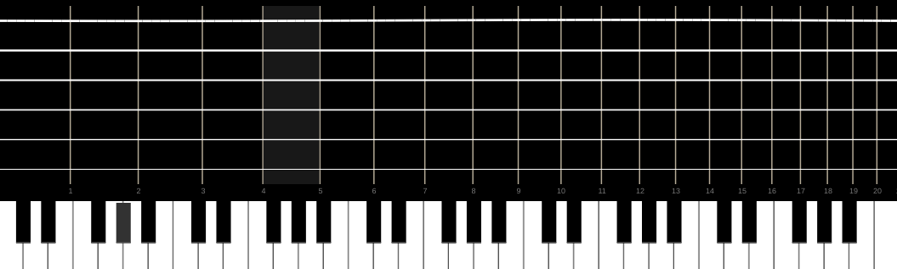

# Old Guitarist

Old guitarist is a physically modeled virtual guitar plugin.



## Physical Model

$$ \frac{\partial^2 y}{\partial t^2} = c^2 \frac{\partial^2 y}{\partial x^2} - \gamma \frac{\partial y}{\partial t} - \frac{EI}{\mu} \frac{\partial^4 y}{\partial x^4} $$

$$ c = \sqrt{\frac{T}{\mu}}, \qquad \mu = \rho \pi r^2, \qquad I = \frac{\pi r^4}{4} $$

$$ y(0, t) = y(l, t) = 0 $$

$$ y(x, 0) = \begin{cases} \dfrac{y_{\max}}{x_p} \, x & 0 \leq x < x_p \\[6pt] \dfrac{y_{\max}}{l - x_p} \, (l - x) & x_p \leq x \leq l \end{cases} $$

$y_{\max} = 0.02 \; m$, $x_p = 0.125 \, l$, $\partial y / \partial t \, (x, 0) = 0$.

### Discretization

$$ \Delta x = \frac{l}{N - 1}, \qquad \Delta t = \frac{1}{f_s}, \qquad f_s = 48000 \; Hz, \qquad N = 101 $$

$$ \frac{\partial^2 y}{\partial x^2} \bigg|_{i} \approx \frac{y_{i-1} - 2y_i + y_{i+1}}{\Delta x^2} $$

$$ \frac{\partial^4 y}{\partial x^4} \bigg|_{i} \approx \frac{y_{i-2} - 4y_{i-1} + 6y_i - 4y_{i+1} + y_{i+2}}{\Delta x^4} $$

### Crank–Nicolson

$$ \frac{y_i^{n+1} - 2y_i^n + y_i^{n-1}}{\Delta t^2} = c^2 \left[ \theta \frac{\nabla^2 y_i^{n+1}}{\Delta x^2} + (1 - \theta) \frac{\nabla^2 y_i^n}{\Delta x^2} \right] - \frac{\gamma}{2\Delta t} \left( y_i^{n+1} - y_i^{n-1} \right) - \frac{EI}{\mu} \frac{\nabla^4 y_i^n}{\Delta x^4} $$

$\theta = 0.5$

### Tridiagonal system

$$ -\theta r \, y_{i-1}^{n+1} + (1 + 2\theta r) \, y_i^{n+1} - \theta r \, y_{i+1}^{n+1} = \text{RHS}_i $$

$$ r = \frac{c^2 \Delta t^2}{\Delta x^2} $$

$$ \text{RHS}_i = 2y_i^n - y_i^{n-1} + (1 - \theta) \, r \, \nabla^2 y_i^n + \frac{\gamma \Delta t}{2} \, y_i^{n-1} - \frac{EI}{\mu} \frac{\Delta t^2}{\Delta x^4} \, \nabla^4 y_i^n $$

### Thomas algorithm

$$ c'_0 = \frac{o}{d}, \qquad d'_0 = \frac{b_0}{d} $$

$$ m_i = d - o \cdot c'_{i-1}, \qquad c'_i = \frac{o}{m_i}, \qquad d'_i = \frac{b_i - o \cdot d'_{i-1}}{m_i} $$

$$ y_{N-3}^{n+1} = d'_{N-3}, \qquad y_i^{n+1} = d'_i - c'_i \cdot y_{i+1}^{n+1} $$

$d = 1 + 2\theta r$, $o = -\theta r$.

### Stability

$$ \frac{\Delta x}{\Delta t \cdot c} \leq 1 $$

### Convolution

$$ (y * h)(t) = \int_{-\infty}^{\infty} y(\tau) \, h(t - \tau) \, d\tau $$

## Vectorization

### State

$$ \mathbf{s} = \left[ \mathbf{y}_n \;\; \mathbf{y}_{n-1} \right] \in \mathbb{R}^{2N} $$

### Interior DOF

$$ \mathbf{u} = [y_2^n, \, y_3^n, \, \ldots, \, y_{N-3}^n]^\top \in \mathbb{R}^S, \qquad S = N - 4 $$

### Laplacian

$$ \nabla^2 \mathbf{u} = \mathbf{y}_{n,[1:S]} - 2\mathbf{u} + \mathbf{y}_{n,[3:S+2]} $$

### Fourth derivative

$$ \nabla^4 \mathbf{u} = \mathbf{y}_{n,[0:S]} - 4\mathbf{y}_{n,[1:S+1]} + 6\mathbf{u} - 4\mathbf{y}_{n,[3:S+3]} + \mathbf{y}_{n,[4:S+4]} $$

### Right-hand side

$$ \mathbf{b} = 2\mathbf{u} - \mathbf{u}_{n-1} + (1-\theta) \, r \, \nabla^2 \mathbf{u} + \frac{\gamma \Delta t}{2} \, \mathbf{u}_{n-1} - \frac{EI}{\mu} \frac{\Delta t^2}{\Delta x^4} \, \nabla^4 \mathbf{u} $$

### Tridiagonal

$$ \begin{bmatrix} d & o & & \\ o & d & \ddots & \\ & \ddots & \ddots & o \\ & & o & d \end{bmatrix} \mathbf{u}^{n+1} = \mathbf{b} $$

### Pluck

$$ y_i^0 = \begin{cases} \dfrac{y_{\max}}{x_p} \, x_i & x_i < x_p \\[4pt] \dfrac{y_{\max}}{l - x_p} \, (l - x_i) & x_i \geq x_p \end{cases} $$

## Per-string parameters

| String | Note | $r$ (mm) | $T$ (N) | $\mu$ (kg/m) | $c$ (m/s) |
|--------|------|----------|---------|--------------|-----------|
| 6 | E2 | 1.30 | 72 | $5.72 \times 10^{-3}$ | 112.0 |
| 5 | A2 | 1.00 | 68 | $3.61 \times 10^{-3}$ | 137.4 |
| 4 | D3 | 0.85 | 65 | $2.60 \times 10^{-3}$ | 157.8 |
| 3 | G3 | 0.75 | 60 | $2.02 \times 10^{-3}$ | 172.4 |
| 2 | B3 | 0.65 | 55 | $1.52 \times 10^{-3}$ | 189.8 |
| 1 | E4 | 0.55 | 50 | $1.10 \times 10^{-3}$ | 213.2 |

$\rho = 1150 \; kg/m^3$, $l = c / (2f)$ where $f$ is the MIDI note frequency.

## Build

```bash
git clone https://codeberg.org/vivekvjyn/Old-guitarist.git
cd Old-guitarist
git submodule update --init --recursive
cmake -B build -G Ninja
cmake --build build
```
